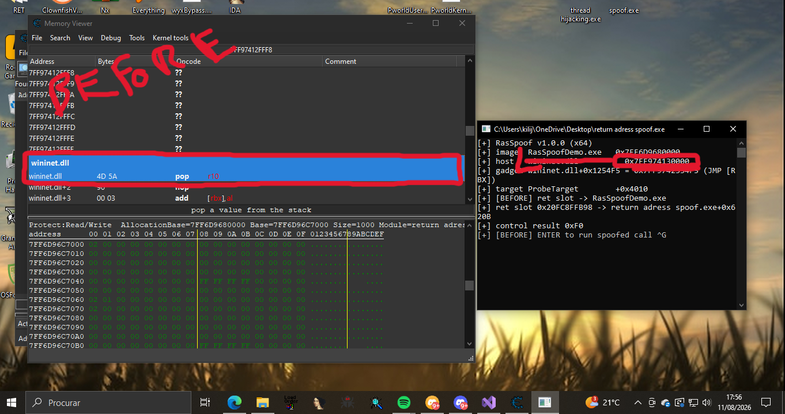
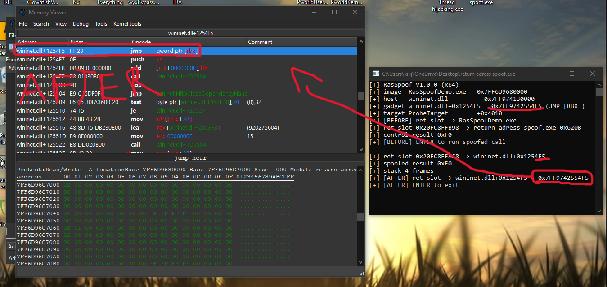

# Return Address Spoofing (x64)

Built by **RingShift Researchers** — project by **Pworld** (Discord: `mmcopy`).

[](https://discord.gg/7sxw7DnShj)

Inspired by [The Stack Series: Return Address Spoofing on x64](https://sabotagesec.com/the-stack-series-return-address-spoofing-on-x64/) by SabotageSec.

Have you ever thought about your aimbot calling its function — and the anti-cheat being able to see exactly which address that call came from? Yeah — every function starts from an address, and that address gets recorded on the stack.

Think of it like this: whenever your code calls any function, the CPU pushes the "way back" address onto the stack — the place execution should return to. And that's exactly what the anti-cheat reads. When it notices something interesting happening, it performs a stack walk: it asks the stack "who called this?" — and the answer is the caller's address.

> And there's the problem: you don't just call the aimbot. You call the aimbot, the ESP, the input hook, the renderer, the driver communication, the memory writer... each one of these is a function originating from an address — and every single address points back to your code. It only takes one of those calls to fall under inspection, and the whole walk leads the anti-cheat straight to you.
>
> That's where return address spoofing comes in.
>
> Before the interesting call executes, we swap the return address sitting on the stack. Instead of pointing to your code, it now points to a gadget — an innocent instruction sequence like `jmp qword ptr [rbx]` — inside a legitimate system DLL like `wininet.dll`.

## The practical result

```
without spoof:  stack walk -> your cheat's address   -> flagged
with spoof:     stack walk -> wininet.dll+0x1254F5   -> looks like Windows
```

The real address is kept in a context struct, the target runs normally, and when it finishes, its `ret` lands on the gadget — which jumps to the fixup — and the fixup hands execution back to your original code, as if nothing ever happened. Your cheat keeps running, but as far as the stack is concerned, the call "came from" the system.

| Before | After |
|---|---|
|  |  |

Before: the probe sees the return address inside `demo.exe` (your code). After: the same probe sees `wininet.dll+0x1254F5` — a legitimate system module.

## How it works

1. `Spoofer::Call` packs up to 10 integer/pointer arguments and writes a `SpoofContext` (`trampoline`, `target`, `original_ret`, `saved_rbx`).
2. `DispatchN` forwards to the MASM routine `SpoofDispatch` (`src/dispatch.asm`), which:
   - stores the real return address and caller `RBX` in the context,
   - overwrites the return address slot with a `jmp qword ptr [rbx]` gadget,
   - jumps into the target.
3. When the target returns, it lands on the gadget, which jumps to `fixup`.
4. `fixup` restores `RBX`, reverts the stack adjustments and resumes at the original return address — as if the dispatch never happened.

The gadget (`FF 23`) is located at runtime by scanning the executable sections of `wininet.dll` (fallback: `kernel32.dll`, `ntdll.dll`), rejecting candidates adjacent to banned bytes.

## Project structure

```
spoof.sln
spoof/                 static library (spf namespace)
  include/spoof/       api.hpp  gadget.hpp  hook.hpp  log.hpp  pe.hpp
  src/                 api.cpp  dispatch.asm  gadget.cpp  hook.cpp  log.cpp  pe.cpp
demo/
  main.cpp             console demo (BEFORE/AFTER flow, --messagebox, --gadgets)
imagens/               before.png / after.png
```

## Build

Visual Studio 2022 (v143, x64, C++20) or:

```powershell
& "C:\Program Files\Microsoft Visual Studio\2022\Community\MSBuild\Current\Bin\amd64\MSBuild.exe" spoof.sln -p:Configuration=Release -p:Platform=x64
```

Output: `bin\x64\Release\demo.exe`.

## Usage

```powershell
bin\x64\Release\demo.exe [--no-color] [--no-pause] [--level <level>]
                         [--module <dll>] [--messagebox] [--gadgets <n>]
```

- `--module <dll>` — module to scan for the gadget (default `wininet.dll`)
- `--gadgets <n>` — list the first `n` `FF 23` gadgets in a module and exit
- `--messagebox` — IAT-hook `USER32.dll!MessageBoxA` and dispatch it through the spoofed path
- `--level trace|debug|info|warn|error` — verbosity
- `--no-pause` / `--no-color` — skip the ENTER pauses / disable colors

The pauses in the default flow exist so you can attach a debugger between the control run and the spoofed run.

## Disclaimer

For educational and research purposes only. Use responsibly and only in environments you are authorized to test.